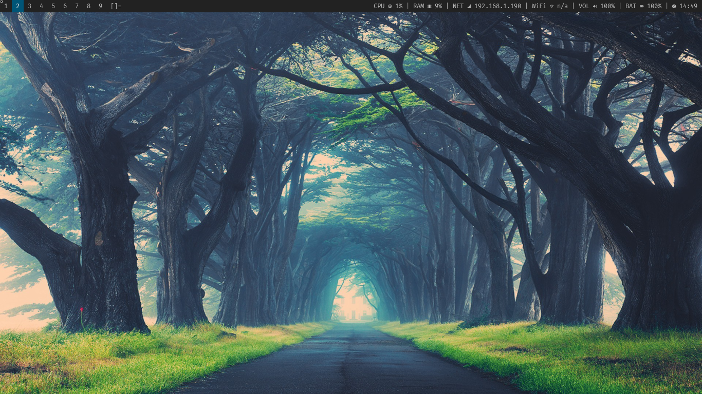
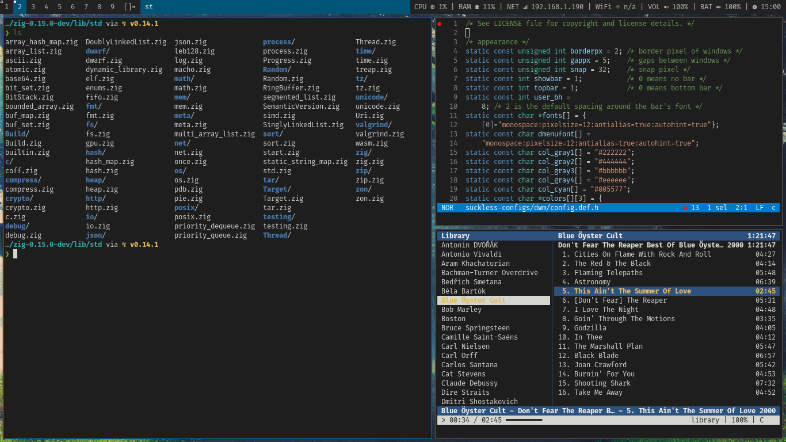

---

### Step-by-Step Guide to Publish Your Project

Follow these commands in your terminal.

#### 1. Rename and Prepare the Project Directory

First, let's rename the project directory to `NixOS-with-Suckless` as you requested.

```bash
# Navigate to the parent directory of your project
cd ~/Utveckling/

# Rename the project folder
mv nixos-suckless NixOS-with-Suckless

# Enter the newly renamed project directory
cd NixOS-with-Suckless
```

#### 2. Update the README.md

Now, replace the entire content of your existing `README.md` file with the updated version below. This new version includes the correct paths to your images and an important note about how Nix handles `.git` directories.

**(Copy the entire markdown block below and save it as `README.md` in your project root)**

# Declarative Suckless Desktop on NixOS

<div align="center">


</div>

This repository contains a complete, declarative configuration for a minimal and powerful desktop environment on NixOS. It fuses the minimalist philosophy of the [suckless.org](https://suckless.org/) toolset with the reproducible and robust system management of NixOS, using Flakes and Home Manager.

The core principle is to treat the Suckless source code not as something to be manually compiled, but as an integral part of the system's declarative configuration. Patches and custom `config.h` files are applied at build time, resulting in a fully reproducible, custom-tailored desktop environment.

## Screenshots

<p align="center">
  
  
</p>

## Table of Contents

- [Core Philosophy](#core-philosophy)
- [Features](#features)
- [System Structure](#system-structure)
- [The Declarative Suckless Build Process](#the-declarative-suckless-build-process)
- [Key Configuration Details](#key-configuration-details)
  - [Slock: The Exception](#slock-the-exception)
  - [GTK Theming without Daemons](#gtk-theming-without-daemons)
  - [The `xinitrc` Session](#the-xinitrc-session)
- [Installation and Replication](#installation-and-replication)
- [Daily Workflow](#daily-workflow)

## Core Philosophy

This setup is born from two ideals:

1.  **Suckless:** Software that is simple, minimal, and does one thing well. The configuration is done by patching and editing the C source code directly.
2.  **NixOS:** A Linux distribution where the entire system configuration—from the kernel to packages to dotfiles—is defined in a set of declarative files. Builds are reproducible and atomic.

By combining them, we achieve the ultimate goal: a system where even our custom-patched window manager and terminal are just another part of a single, version-controlled, reproducible configuration.

## Features

-   **Fully Declarative:** The entire system is managed by the Nix Flake in this repository.
-   **Custom Suckless Stack:**
    -   **`dwm`**: Dynamic Window Manager, custom-built from source with patches for full gaps, movestack, and bar height.
    -   **`st`**: Simple Terminal, custom-built with patches for ligatures and scrollback.
    -   **`dmenu`**: Dynamic Menu, custom-built with a line-height patch.
    -   **`slstatus`**: Status bar for `dwm`, custom-built with user-configured components.
-   **Secure Screen Locking:** `slock` is installed from the Nixpkgs repository and given proper SUID permissions via a security wrapper for robustness.
-   **Home Manager:** Manages all user-level configuration, including dotfiles, packages, services, and environment variables.
-   **Minimalist Session Management:** Uses a declarative `~/.xinitrc` file to launch the `dwm` session via `startx`, which is triggered automatically on console login.
-   **Consistent Theming:** Manual GTK/QT configuration ensures a consistent Adwaita-dark theme for graphical applications without needing the heavy `dconf` daemon.
-   **Modern Shell:** Zsh with auto-suggestions, syntax highlighting, and useful aliases.
-   **Configured Applications:** Includes pre-configured settings for `helix`, `git`, `zathura`, and more.

## System Structure

The repository is organized to clearly separate concerns:

```
.
├── flake.nix                 # The central entry point for the entire system build.
├── configuration.nix         # System-level NixOS settings (kernel, filesystems, etc.).
├── hardware-configuration.nix  # Hardware-specific settings (auto-generated).
├── users/
│   └── blfnix.nix            # User-level configuration via Home Manager.
├── suckless-configs/         # Raw source code for the suckless tools. This is where you edit config.def.h!
│   ├── dwm/
│   ├── st/
│   ├── dmenu/
│   └── slstatus/
├── dotfiles/                 # Static configuration files (e.g., for helix) managed by Home Manager.
│   └── helix/
└── assets/                   # Screenshots for the README.
    ├── nix-suckless-apps.png
    └── nix-suckless-desktop.png
```

-   **`flake.nix`**: Defines the project's inputs (nixpkgs, home-manager) and orchestrates the build, importing `configuration.nix` and the Home Manager module for the user.
-   **`configuration.nix`**: Defines the machine. This includes hardware, networking, system-wide packages, fonts, and the `slock` security wrapper.
-   **`users/blfnix.nix`**: Defines the user environment. It contains the logic for building the custom suckless tools, installing user packages, and generating all configuration files (`.xinitrc`, `.zshrc`, GTK settings, etc.).
-   **`suckless-configs/`**: This is the heart of the customization. It holds the pristine source code for each suckless tool, along with any patches and, most importantly, your modified `config.def.h` files.

## The Declarative Suckless Build Process

The magic happens in `users/blfnix.nix` within the `buildCustomSucklessTool` function. This is a generic Nix derivation factory that:

1.  Takes the name of a tool (e.g., `dwm`).
2.  Finds its source code in the `suckless-configs/` directory.
3.  Copies the user-modified `config.def.h` to `config.h` within the Nix build sandbox.
4.  Applies any patches listed in the `patches/` subdirectory.
5.  Compiles the tool using `clang` in a pure, reproducible environment.
6.  Installs the resulting binary into the Nix store.

> **Note on Build Purity:** You asked about excluding `.git` directories. This is handled automatically! When Nix copies a local source directory (like `./suckless-configs/dwm`) into the build environment, its **built-in source filtering** automatically ignores version control directories (`.git`, `.svn`, etc.). This ensures that only the actual source code is part of the build, maintaining purity and preventing unnecessary rebuilds.

This approach elevates your Suckless C source code to be a first-class citizen of your NixOS configuration. To change a keybinding, you simply edit `suckless-configs/dwm/config.def.h` and rebuild your system.

## Key Configuration Details

### Slock: The Exception

While `dwm`, `st`, `dmenu`, and `slstatus` are built from source, `slock` is installed directly from the Nixpkgs repository. This is a deliberate security decision. `slock` requires elevated (root) permissions to function correctly. Instead of managing this manually, we leverage NixOS's robust `security.wrappers` feature to create a secure SetUID wrapper for the pre-built, trusted package from Nixpkgs.

### GTK Theming without Daemons

To maintain a minimal environment, this setup avoids the `dconf` service typically used for GTK settings. Instead, it generates `settings.ini` files for GTK2, GTK3, and GTK4 directly. This forces modern applications to use the simple file-based configuration backend, providing consistent dark theming and font rendering for all graphical apps without any background daemons.

### The `xinitrc` Session

The entire graphical session is defined declaratively in `users/blfnix.nix` and generated as `~/.xinitrc`. This script is responsible for:
-   Loading Xresources (`xrdb`).
-   Starting the `picom` compositor.
-   Setting the wallpaper with `feh`.
-   Launching the `polkit-gnome` authentication agent (for privilege escalation dialogs).
-   Running `xautolock` with `slock`.
-   Starting the `slstatus` bar in a loop.
-   Finally, executing `dwm` itself.

## Installation and Replication

To use this configuration on your own machine:

1.  **Prerequisites**: You need a working NixOS installation with Flakes enabled.

2.  **Clone the Repository**:
    ```bash
    git clone https://github.com/bengtfrost/NixOS-with-Suckless.git
    cd NixOS-with-Suckless
    ```

3.  **Adapt for Your Hardware**:
    **CRITICAL:** You **must** replace `hardware-configuration.nix` with the one generated for your own machine during your NixOS installation (usually found at `/etc/nixos/hardware-configuration.nix`).

4.  **Adapt for Your User**:
    -   You may want to rename `users/blfnix.nix` to `users/your-username.nix`.
    -   In `flake.nix`, change `home-manager.users.blfnix` to `home-manager.users.your-username`.
    -   In `configuration.nix`, change `users.users.blfnix` to `users.users.your-username`.
    -   In `users/your-username.nix`, update the `home.username` and `home.homeDirectory` fields.

5.  **Build the System**:
    Run the `nixos-rebuild` command from within the repository directory. The `switch` command will build and immediately activate the new configuration.
    ```bash
    sudo nixos-rebuild switch --flake .#nixos
    ```

## Daily Workflow

-   **To change a `dwm` keybinding:**
    1.  Edit `suckless-configs/dwm/config.def.h`.
    2.  Run your build alias: `nix-update-system`.

-   **To change your terminal's appearance:**
    1.  Edit `suckless-configs/st/config.def.h`.
    2.  Run `nix-update-system`.

-   **To add a new application (e.g., `inkscape`):**
    1.  Add `pkgs.inkscape` to the `home.packages` list in `users/blfnix.nix`.
    2.  Run `nix-update-system`.

The `nix-update-system` alias is defined in `.zshrc` and points to the `sudo nixos-rebuild switch` command, ensuring a consistent workflow for all system changes.

---
*This configuration is provided under the MIT License.*
